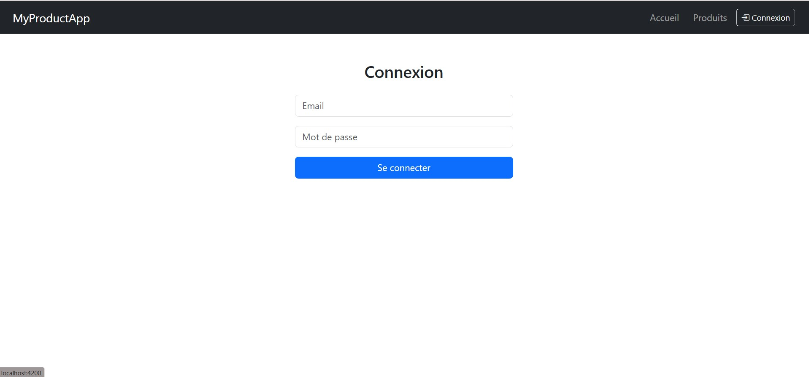
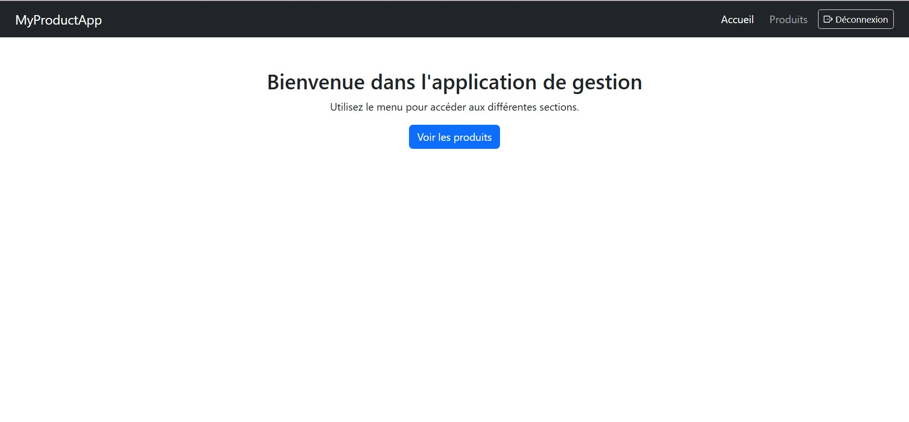
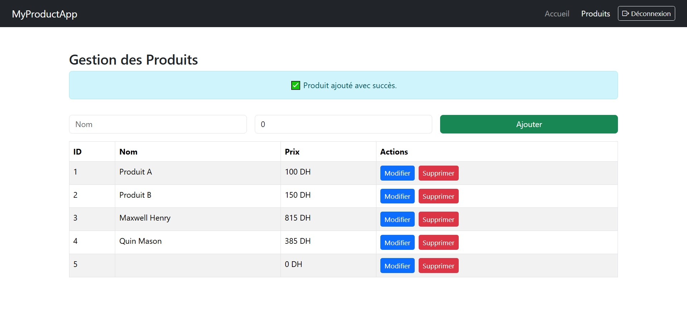
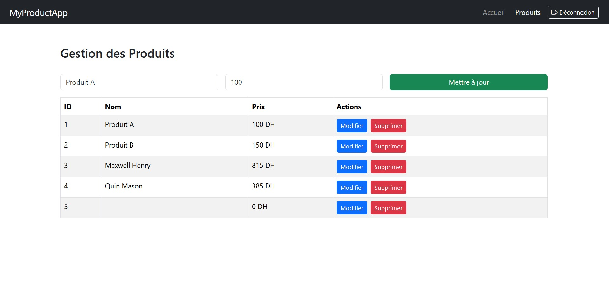
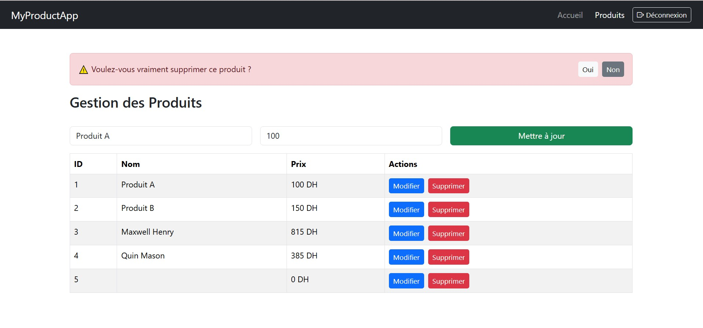
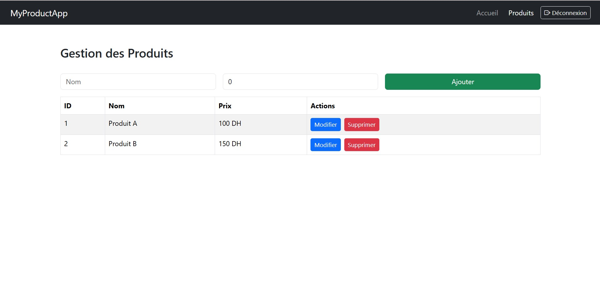

# 📦 MyProductApp — Gestion de Produits avec Angular

Application Angular moderne pour la gestion des produits avec authentification, CRUD, et navigation sécurisée.

---

## 🚀 Fonctionnalités

- ✅ Connexion par email / mot de passe
- 🔒 Sécurité avec AuthGuard
- 🧭 Navigation conditionnelle (Connexion / Déconnexion)
- 📋 Liste de produits locale (id, nom, prix, selected, checked)
- ➕ Ajouter, ✏️ Modifier, 🗑 Supprimer des produits
- ⚠ Confirmation avant suppression
- 🎉 Messages de succès pour chaque action

---

## 📸 Aperçu visuel

### 🔐 Page de connexion

### 🏠 Page d'accueil

### ➕ Ajout d’un produit

### 📝 Modification d’un produit

### 🗑️ Confirmation de suppression

### 📄 Liste des produits

---

## 🧪 Accès de test

> **Email :** `admin@ocpgroup.ma`  
> **Mot de passe :** `password`

---

## 🛠 Technologies utilisées

- Angular 17+
- Bootstrap 5 & Bootstrap Icons
- TypeScript
- LocalStorage (pour persister l'état de connexion)
- Angular Router + AuthGuard
- Design responsive mobile/desktop

---

## 📁 Structure du projet
